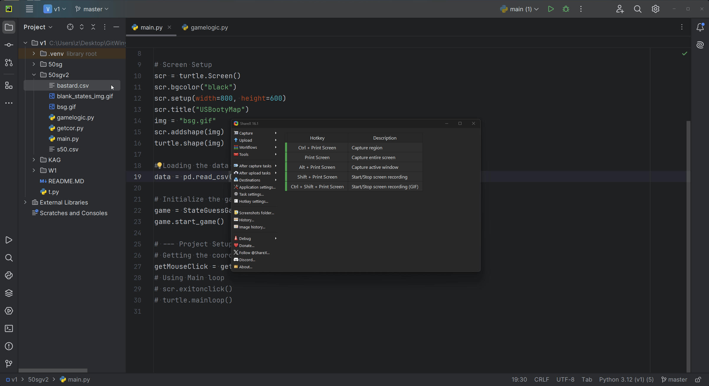

# utcpd251-

> Work being done with csv readers and data frame. Part of the work will also be done in ksg

1. L230 - Al being done in kag
2. L251 - Also being done in KAG notebook.

# Dira 

N | What ? 
--- | --- 
[`KAG`](./KAG) | Notebooks work
[`50sg`](./50sg) | 50 States Game
[`50sgv2`](./50sgv2) | Second version of the game with your own thing

# [`50sgv2`](./50sgv2)

1. Working with writing to csv

